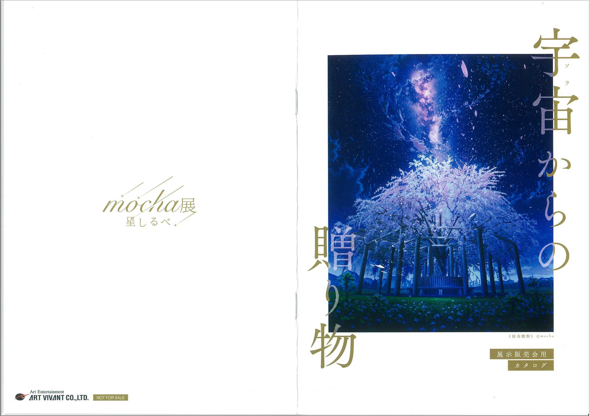
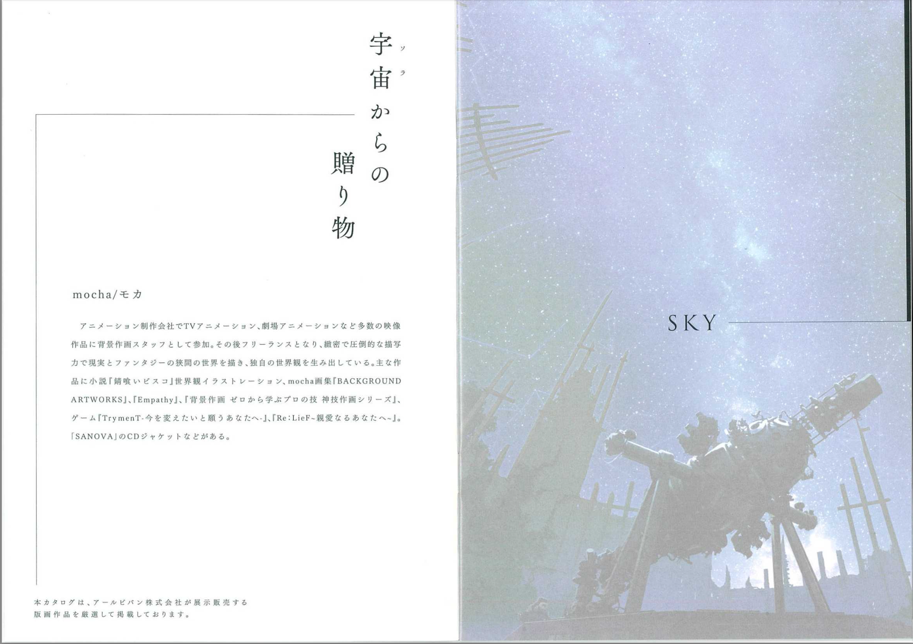
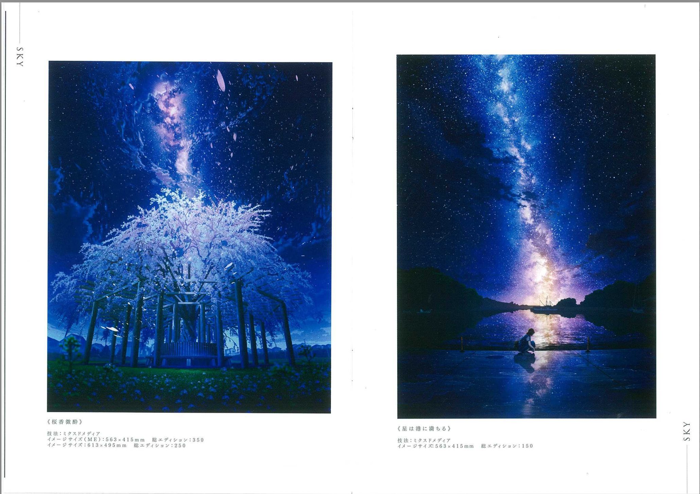
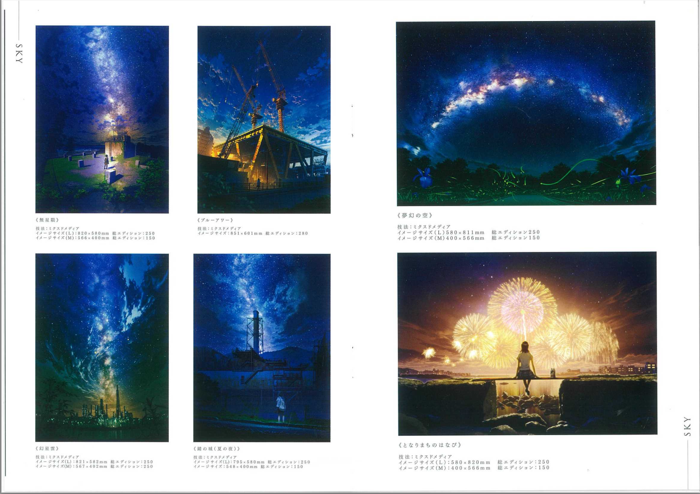
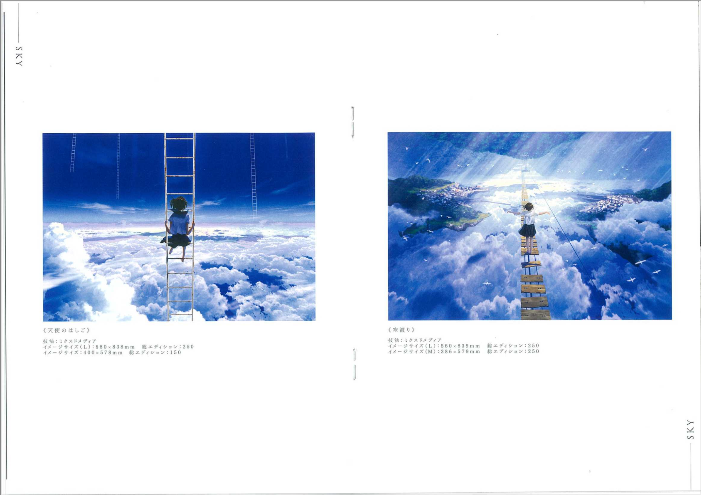
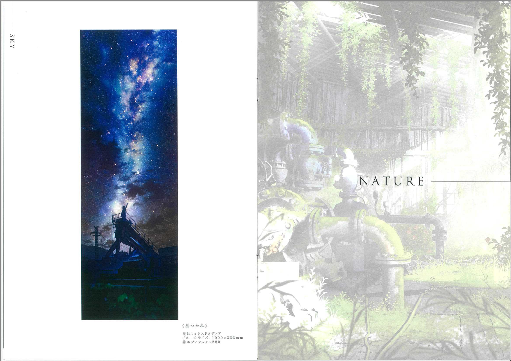
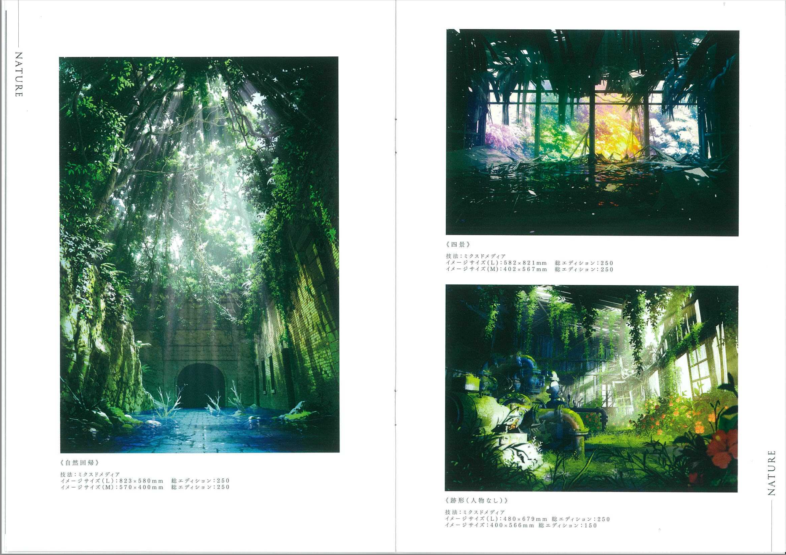
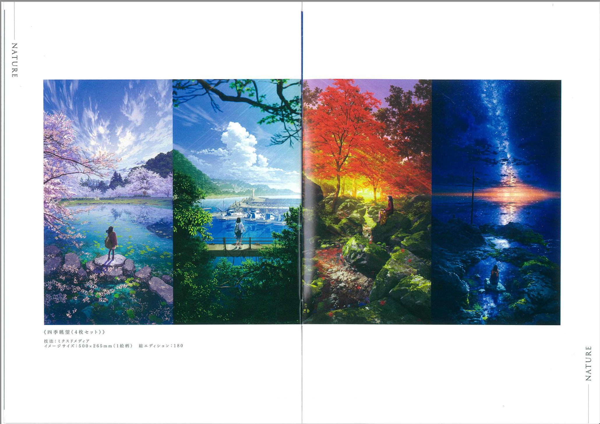
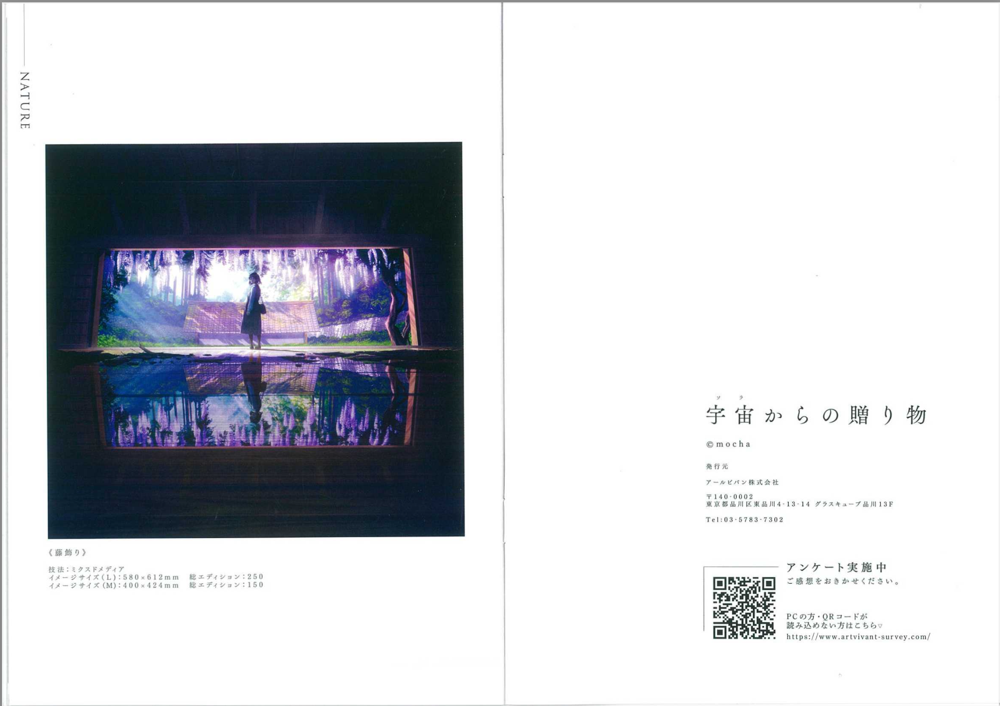

# mocha

<html>
<head>

<meta charset="UTF-8">
<meta http-equiv="Content-Type" content="text/html; charset=UTF-8">
<meta http-equiv="X-UA-Compatible" content="IE=EmulateIE10" />
<meta http-equiv="X-UA-Compatible" content="IE=edge">

<!--ここから上はお決まりの定型文です-->

<!--ここからが表現の書式などを決めるcssという部分-->

<link href="https://cdnjs.cloudflare.com/ajax/libs/lightbox2/2.7.1/css/lightbox.css" rel="stylesheet">

</head>

<body>
<!--
-->

<!--
<h2>

  モバイル端末をお使いの場合は、画面を横向きにすると
  より見やすくご覧頂けます。
	
</h2>
<!--ここ上は、ほぼそのまま使います！-->

<!--ぱんくずリスト-->
<!--

<a href="https://dorikawa.github.io/20210704_Utsunomiya_swim/">2021年宇都宮市民大会</a>><a href="https://dorikawa.github.io/HP_build/">IT関連情報IT関連情報</a>>HPの作り方

-->
<!--QRコードの挿入例-->

 アクセス用QRコード

	

<marquee direction="left" scrollamount="10" width="30%">(^_^)/~Torokoid_Mibu</marquee>

<!--流れ文字の挿入例-->
<h1><marquee behavior="left">!!! mocha パンフレット !!!</marquee></h1>

<!--ここから下が、本体部分-->
	

<a href="https://www.eizo.co.jp/solutions/solution/creative/mocha/">mocha氏HPリンク</a>

        

	
	
	
	

<!--
-->
<!--本体はここまで-->

<!--画面に空白地帯を作って、背景が見えるようにしています-->
                                              

<h6>

 2023/10/08、宇宙からの贈り物@宇都宮市マロニエプラザ！

</h6>
<!-- フッタ -->
<footer>
	 2023/10/08 T.Mibu
</footer>

<!--HPにさまざまなJavaScriptを呼び込むための書式-->

</body>

</html>
